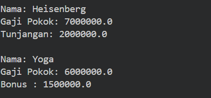
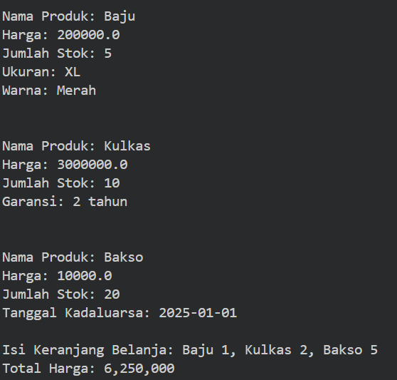

# OOP-Praktikum-6

## Latihan 
Class Pegawai :
```java
class Pegawai {
    private String nama;
    private double gajiPokok;

    // Constructor tanpa parameter
    public Pegawai() {
        this.nama = "";
        this.gajiPokok = 0;
    }

    // Constructor dengan parameter nama
    public Pegawai(String nama) {
        this.nama = nama;
        this.gajiPokok = 0;
    }

    // Constructor dengan parameter nama dan gajiPokok
    public Pegawai(String nama, double gajiPokok) {
        this.nama = nama;
        this.gajiPokok = gajiPokok;
    }

    public void setNama(String nama) {
        this.nama = nama;
    }

    public String getNama() {
        return nama;
    }

    public void setGajiPokok(double gajiPokok) {
        this.gajiPokok = gajiPokok;
    }

    public double getGajiPokok() {
        return gajiPokok;
    }

    public void cetakInfo() {
        System.out.println("Nama: " + nama);
        System.out.println("Gaji Pokok: " + gajiPokok);
    }
}

class Manager extends Pegawai {
    private double tunjangan;

    // Constructor tanpa parameter
    public Manager() {
        super();
        this.tunjangan = 0;
    }

    // Constructor dengan parameter nama
    public Manager(String nama) {
        super(nama);
        this.tunjangan = 0;
    }

    // Constructor dengan parameter nama dan gajiPokok
    public Manager(String nama, double gajiPokok) {
        super(nama, gajiPokok);
        this.tunjangan = 0;
    }

    // Constructor dengan parameter nama, gajiPokok dan tunjangan
    public Manager(String nama, double gajiPokok, double tunjangan) {
        super(nama, gajiPokok);
        this.tunjangan = tunjangan;
    }

    public void setTunjangan(double tunjangan) {
        this.tunjangan = tunjangan;
    }

    public double getTunjangan() {
        return tunjangan;
    }

    public void cetakInfo() {
        super.cetakInfo();
        System.out.println("Tunjangan: " + tunjangan);
    }
}

class Programmer extends Pegawai {
    private double bonus;

    // Constructor Default
    public Programmer() {
    }

    // Constructor with nama, gajiPokok and bonus
    public Programmer(String nama, double gajiPokok, double bonus) {
        super(nama, gajiPokok);
        this.bonus = bonus;
    }

    // Method
    public void setBonus(double bonus) {
        this.bonus = bonus;
    }

    public double getBonus() {
        return this.bonus;
    }

    @Override
    public void cetakInfo() {
        super.cetakInfo();
        System.out.println("Bonus : " + bonus);
    }

    public void cetakBonus() {
        System.out.println("Bonus : " + bonus);
    }
}
```

Class Main:
```java
public class Main {
    public static void main(String[] args) {
        System.out.println();

        Manager manager = new Manager("Heisenberg", 7000000, 2000000);
        manager.cetakInfo();
        System.out.println();

        Programmer programmer = new Programmer("Yoga", 6000000, 1500000);
        programmer.cetakInfo();
        System.out.println();
    }
}
```

Output:



## Sistem Pembelian Online dengan Keranjang Belanja
Class Produk:
```java
import java.util.HashMap;
import java.util.Map;
import java.text.DecimalFormat; // Tambahkan import ini

class Produk {
    String namaProduk;
    double harga;
    int jumlahStok;

    public Produk(String namaProduk, double harga, int jumlahStok) {
        this.namaProduk = namaProduk;
        this.harga = harga;
        this.jumlahStok = jumlahStok;
    }

    public void displayInfo() {
        System.out.println();
        System.out.println("Nama Produk: " + namaProduk);
        System.out.println("Harga: " + harga);
        System.out.println("Jumlah Stok: " + jumlahStok);
    }

    public String getNamaProduk() {
        return namaProduk;
    }

    public double getHarga() {
        return harga;
    }
}

class Elektronik extends Produk {
    int garansi;

    public Elektronik(String namaProduk, double harga, int jumlahStok, int garansi) {
        super(namaProduk, harga, jumlahStok);
        this.garansi = garansi;
    }

    @Override
    public void displayInfo() {
        super.displayInfo();
        System.out.println("Garansi: " + garansi + " tahun");
    }
}

class Pakaian extends Produk {
    String ukuran;
    String warna;

    public Pakaian(String namaProduk, double harga, int jumlahStok, String ukuran, String warna) {
        super(namaProduk, harga, jumlahStok);
        this.ukuran = ukuran;
        this.warna = warna;
    }

    @Override
    public void displayInfo() {
        super.displayInfo();
        System.out.println("Ukuran: " + ukuran);
        System.out.println("Warna: " + warna);
    }
}

class Makanan extends Produk {
    String tanggalKadaluarsa;

    public Makanan(String namaProduk, double harga, int jumlahStok, String tanggalKadaluarsa) {
        super(namaProduk, harga, jumlahStok);
        this.tanggalKadaluarsa = tanggalKadaluarsa;
    }

    @Override
    public void displayInfo() {
        super.displayInfo();
        System.out.println("Tanggal Kadaluarsa: " + tanggalKadaluarsa);
    }
}

class KeranjangBelanja {
    Map<Produk, Integer> produk = new HashMap<>(); // Menggunakan HashMap untuk menyimpan produk dengan jumlahnya

    public void tambahProduk(Produk produk, int jumlah) {
        this.produk.put(produk, this.produk.getOrDefault(produk, 0) + jumlah);
    }

    public void displayInfo() {
        double totalHarga = 0;

        StringBuilder isiKeranjang = new StringBuilder(); // Membuat StringBuilder untuk menyimpan informasi produk
        for (Map.Entry<Produk, Integer> entry : produk.entrySet()) {
            Produk p = entry.getKey();
            int jumlah = entry.getValue();
            p.displayInfo();
            totalHarga += p.getHarga() * jumlah; // Hitung total harga berdasarkan jumlah

            // Tambahkan produk dan jumlah ke StringBuilder
            if (isiKeranjang.length() > 0) {
                isiKeranjang.append(", "); // Tambahkan tanda koma jika sudah ada produk sebelumnya
            }
            isiKeranjang.append(p.getNamaProduk()).append(" ").append(jumlah); // Format: NamaProduk Jumlah
            System.out.println();
        }

        System.out.println("Isi Keranjang Belanja: " + isiKeranjang.toString());

        // Menggunakan DecimalFormat untuk memformat total harga
        DecimalFormat df = new DecimalFormat("#,###");
        System.out.println("Total Harga: " + df.format(totalHarga));
    }
}
```

Class Main:
```java
public class Main {
    public static void main(String[] args) {
        KeranjangBelanja keranjangBelanja = new KeranjangBelanja();

        Elektronik elektronik = new Elektronik("Kulkas", 3000000, 10, 2);
        Pakaian pakaian = new Pakaian("Baju", 200000, 5, "XL", "Merah");
        Makanan makanan = new Makanan("Bakso", 10000, 20, "2025-01-01");

        // Menambahkan produk dengan jumlah tertentu
        keranjangBelanja.tambahProduk(elektronik, 2);
        keranjangBelanja.tambahProduk(pakaian, 1);
        keranjangBelanja.tambahProduk(makanan, 5);

        keranjangBelanja.displayInfo();
        System.out.println();
    }
}
```
Output:


